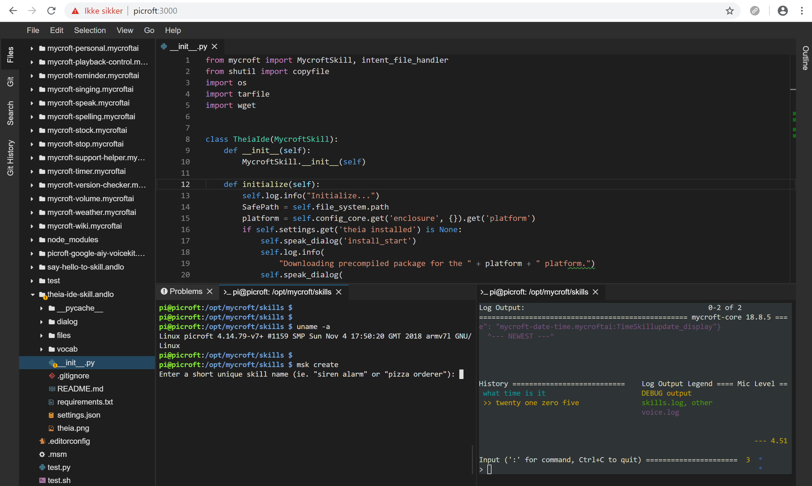

#  THEIA IDE
Installs and setup THEIA IDE locally on your device. Real VS Code experience.


## About
This skill installs Theia IDE on your Mycroft device. This is an easy way to make and edit skills 
with integratio to Github, and tools like mycroft-msm and mycroft-msk directly from the integrated 
shell.

Theia provides Microsoft VS Code experience in the browser.

https://www.theia-ide.org/index.html



## How to install
Install the skill from the market or say "Hey Mycroft, install I D E" or by running this command
```
mycroft-msm install https://github.com/andlo/theia-ide-skill.git
```
Skill will then install THEIA IDE. During installation if on Picroft a precompiled package is 
downloaded and extracted. On other platforms THEIA IDE is build and compiled during installation.
The IDE can not run on Mark_1 and will not instal on low ressource systems - minimum is 4096 Mb ram.

After installation, there should be a log info saying "Installed THEIA IDE OK." and Mycroft should tell 
you by voice that he has installed the skill.
You can then open a web-browser and go to http://device:3000 where device is the hostname of the device.
Ff your Mycroft device is picroft the hostnale is picroft. 

Skillsettings on https://home.mycroft.ai/ have one checkbox for setting autostart or not.

WARNING: There is not any password protection to access the IDE and the integrated terminal.
So think twice before exposing your device to the internet.

## Git integration
The IDE does not have a way to ask for your Github username and password. For seamless integration, 
you can set Git to remember your username and password by entering three git commands.
This can be done in the terminal directly in the IDE.

```
git config --global credential.helper store
git config --global user.name "your_username"
git config --global user.password "your_password"
```

WARNING: Your git account passwords will be saved in plaintext format, in the global
.gitconfig file, e.g in /home/pi/.gitconfig
If this is undesirable to you, use an ssh key for your accounts instead.


## Updating
For now, to update the THEIA IDE remove and reinstall this skill.


## Examples
* "Run IDE"
* "End theia IDE"
* "Restart IDE"

## Credits
Andreas Lorensen (@andlo)

## Licensing
This skill it self is licensed by GNU GENERAL PUBLIC LICENSE Version 3 - https://github.com/andlo/theia-ide-skill/blob/master/LICENSE

The skill will install other software which by them self have individualy and different licenses.
* Theia-ide is licensed by Eclipse Public License version  2 - https://github.com/theia-ide/theia/blob/master/LICENSE
* Node.js seems to have its own license - https://github.com/nodejs/node/blob/master/LICENSE

## Category
**Productivity**

## Tags
#theia
#IDE
#editor
#dev
#vscode
