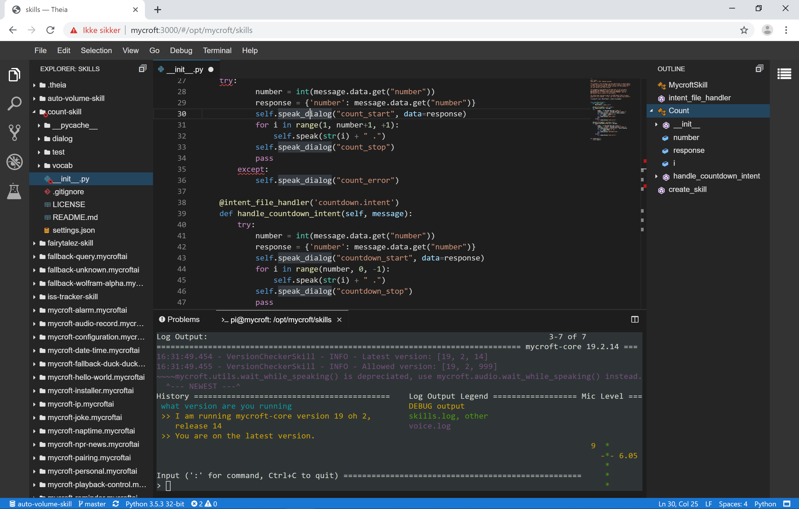

#  THEIA IDE
VS Code experience on your Mycroft device.

## About
Installs and setup THEIA IDE locally on your Mycroft device.

## Description
This skill installs Theia IDE on your Mycroft device. This makes it easy to make and edit skills for Mycroft. Theia IDE integrates with Github, and you can use Mycroft tools like mycroft-msm and mycroft-msk directly from the integrated shell in the IDE.
Theia provides the VS Code experience in the browser.
People familiar with Microsoft's VS Code editor will find many familiar features and concepts.

https://www.theia-ide.org/index.html



## How to install
Install the skill by running this command
```
mycroft-msm install https://github.com/andlo/theia-ide-skill.git
```
Skill will then install THEIA IDE. During installation a precompiled package is downloaded and extracted.

When done, there should be a log info saying "Starting THEIA IDE" and Mycroft should tell you by voice that he has installed the skill.
You can then open a web-browser and go to http://picroft:3000 if your Mycroft device is picroft. If on a Mark One go to http://mark_1:3000
You then get access to the THEIA IDE in a workplace located /opt/mycroft/skills.

Skillsettings on https://home.mycroft.ai/ have one checkbox for setting autostart or not.

WARNING: There is not any password protection to access the IDE and the integrated terminal.
So think twice before exposing your device to the internet.

## Updating
For now, to update the THEIA IDE remove and reinstall this skill.

## Mark 1
On Mark_1 the firewall needs to be open. SSH to your Mark_1 and run the follow command
```
sudo ufw allow from any to any port 3000 proto tcp
```

## Git integration
The IDE doesn't have a way to ask your username and password to github. So to get integration to work seamlessly,
you can set git to remember your username and password.

This is done by these three git commands and can be done in the terminal direcly in the IDE.
```
git config --global credential.helper store
git config --global user.name "your_username"
git config --global user.password "your_password"
```
WARNING: Your git account passwords will be saved in plaintext format, in the global
.gitconfig file, e.g in /home/pi/.gitconfig
If this is undesirable to you, use an ssh key for your accounts instead.


## Examples
* "Start IDE"
* "Stop IDE"
* "Restart IDE"

## Credits
Andreas Lorensen (@andlo)

## Supported Devices
platform_mark1 platform_picroft

## Licensing
This skill it self is licensed by GNU GENERAL PUBLIC LICENSE Version 3 - https://github.com/andlo/theia-ide-skill/blob/master/LICENSE

The skill will install other software which by them self have individualy and different licenses.
* Theia-ide is licensed by Eclipse Public License version  2 - https://github.com/theia-ide/theia/blob/master/LICENSE
* Git is licensed by GNU GENERAL PUBLIC LICENSE Version 2 - https://github.com/git/git/blob/master/COPYING
* Node.js seems to have its own license - https://github.com/nodejs/node/blob/master/LICENSE

## Category
**Configuration**

## Tags
#theia
#IDE
#editor
#dev
